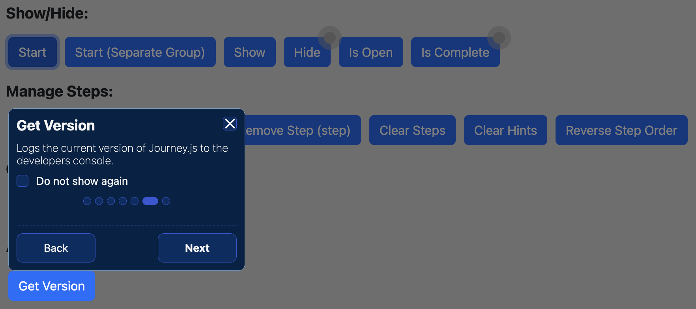

<h1 align="center">
Journey.js

[](https://twitter.com/intent/tweet?text=Journey.js%2C%20a%20free%20JavaScript%journey%builder&url=https://github.com/williamtroup/Journey.js&hashtags=javascript,html,journey,guide)
[](https://www.npmjs.com/package/jjourney.js)
[](https://www.nuget.org/packages/jJourney.js/)
[](https://github.com/williamtroup/Journey.js/blob/main/LICENSE.txt)
[](https://github.com/williamtroup/Journey.js/discussions)
[](https://github.com/williamtroup)
</h1>

> <p align="center">🚶 A lightweight, and easy-to-use, JavaScript library for building a website walk-through guide!</p>
> <p align="center">v0.3.0</p>
<br />


<br>
<br>

<h1>What features does Journey.js have?</h1>

- Zero-dependencies and extremely lightweight!
- Full API available via public functions.
- Fully styled in CSS/SASS and compatible with the Bootstrap library.
- Full CSS theme support (using :root variables, with a default dark-mode theme).
- Custom triggers for actions (when the dialog is shown for an element, or hidden, etc).
- Shortcut keys (click [here](docs/SHORTCUT_KEYS.md) to see the full list).
<br />
<br />

<h1>What browsers are supported?</h1>

All modern browsers (such as Google Chrome, FireFox, and Opera) are fully supported.
<br>
<br>

<h1>What are the most recent changes?</h1>

To see a list of all the most recent changes, click [here](docs/CHANGE_LOG.md).
<br>
<br>

<h1>How do I get started?</h1>

To get started using Journey.js, do the following steps:
<br>
<br>

### 1. Prerequisites:

Make sure you include the "DOCTYPE html" tag at the top of your HTML, as follows:

```markdown
<!DOCTYPE html>
```
<br>

### 2. Include Files:

```markdown
<link rel="stylesheet" href="dist/Journey.js.css" />
<script src="dist/Journey.js"></script>
```
<br>

### 3. DOM Element Binding:

```markdown
<button data-journey-options="{ 'title': 'Get Version', 'description': 'Logs the current version of Journey.js to the developers console.', 'order': 6 }" onclick="console.log( $journey.getVersion() );">Get Version</button>
```

To see a list of all the available binding options you can use for "data-journey-options", click [here](docs/BINDING_OPTIONS.md).

To see a list of all the available custom triggers you can use for "data-journey-options", click [here](docs/BINDING_OPTIONS_CUSTOM_TRIGGERS.md).

<br>

### 4. Finishing Up:

To start the journey, call the following public function:

```markdown
<script> 
  $journey.show();
</script>
```

That's it! Nice and simple. Please refer to the code if you need more help (fully documented).
<br>
<br>

<h1>How do I go about customizing Journey.js?</h1>

To customize, and get more out of Journey.js, please read through the following documentation.
<br>
<br>

### 1. Public Functions:

To see a list of all the public functions available, click [here](docs/PUBLIC_FUNCTIONS.md).
<br>
<br>


### 2. Configuration:

Configuration options allow you to customize how Journey.js will function.  You can set them as follows:

```markdown
<script> 
  $journey.setConfiguration( {
      safeMode: false
  } );
</script>
```

To see a list of all the available configuration options you can use, click [here](docs/CONFIGURATION_OPTIONS.md).